# 🛍️ Sellio - Smart Point of Sales System

<p align="center">
  
</p>

<p align="center">
  <strong>Sellio</strong> adalah aplikasi kasir pintar (Point of Sales - POS) berbasis Android yang dirancang khusus untuk membantu pemilik bisnis, manajer cabang, dan kasir dalam mengelola operasional penjualan, inventaris, karyawan, dan laporan keuangan secara efisien dan waktu nyata (real-time).
</p>

---

## 🚀 Fitur Utama

- **🔑 Sistem Keamanan & Auto-Login**: Halaman masuk (Landing Page) modern dengan validasi email/password lengkap dan status login persisten menggunakan `SharedPreferences`.
- **📊 Laporan Keuangan Real-time**: Grafik dan tabel interaktif untuk memantau pendapatan, total penjualan harian, dan ringkasan transaksi.
- **🛒 Manajemen Transaksi & Cetak Struk**: Modul kasir intuitif untuk memproses pesanan, mengelola keranjang belanja, memilih metode pembayaran, serta menerbitkan struk fisik/digital.
- **📦 Manajemen Produk & Kategori**: Mengatur menu makanan, barang, atau jasa lengkap dengan harga, deskripsi, foto, dan kategori.
- **👥 Pengelolaan Karyawan & Pelanggan**: Menyimpan basis data karyawan beserta jabatannya dan data pelanggan dengan sistem tingkat keanggotaan (Member Level) & poin loyalitas.
- **🏢 Manajemen Multi-Cabang**: Mengelola informasi operasional di berbagai cabang gerai bisnis Anda.
- **☁️ Firebase Realtime Database**: Penyimpanan data yang andal, aman, dan sinkron di semua perangkat kasir secara langsung.

---

## 📸 Antarmuka Aplikasi (Screenshots)

Berikut adalah tampilan visual premium dari aplikasi **Sellio**:

### 🔑 Autentikasi & Profil Pengguna
| Landing Page | Form Login | Profil & Manajemen Akun |
| :---: | :---: | :---: |
| 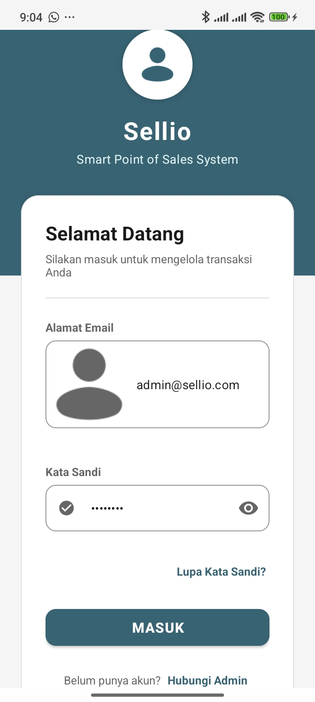 |  | 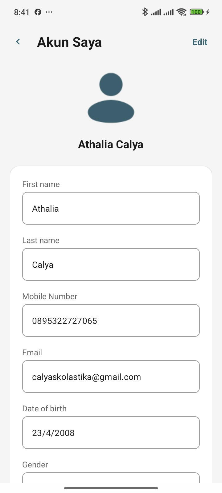 |

### 📊 Dashboard & Transaksi Utama
| Beranda (Dashboard) | Halaman Transaksi Kasir | Proses Pembayaran |
| :---: | :---: | :---: |
| 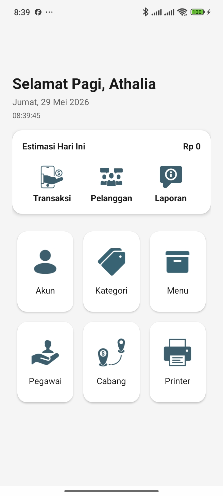 | 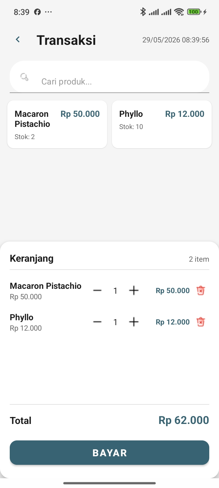 | 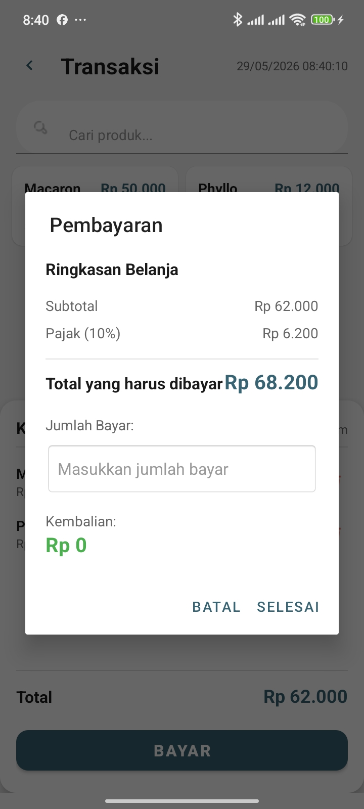 |

### 🧾 Laporan Keuangan & Riwayat
| Struk Pembayaran | Riwayat Transaksi | Grafik Laporan Keuangan |
| :---: | :---: | :---: |
| 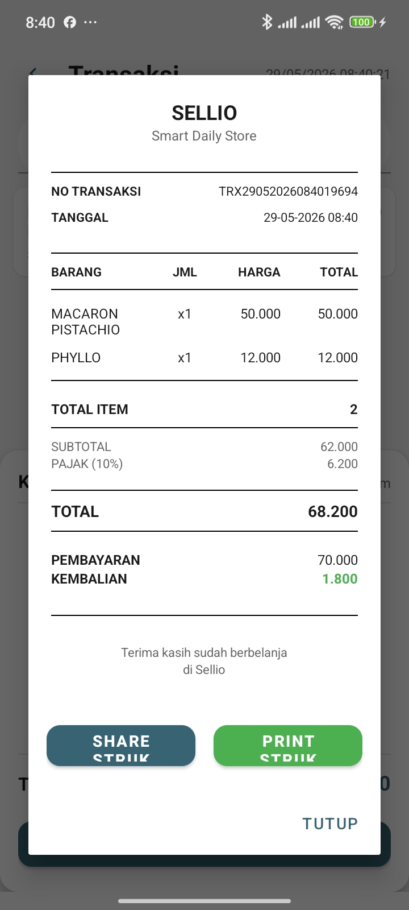 | 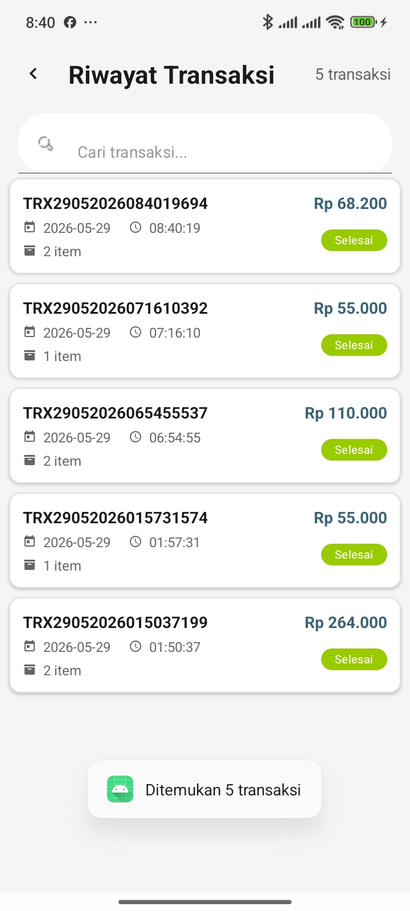 | 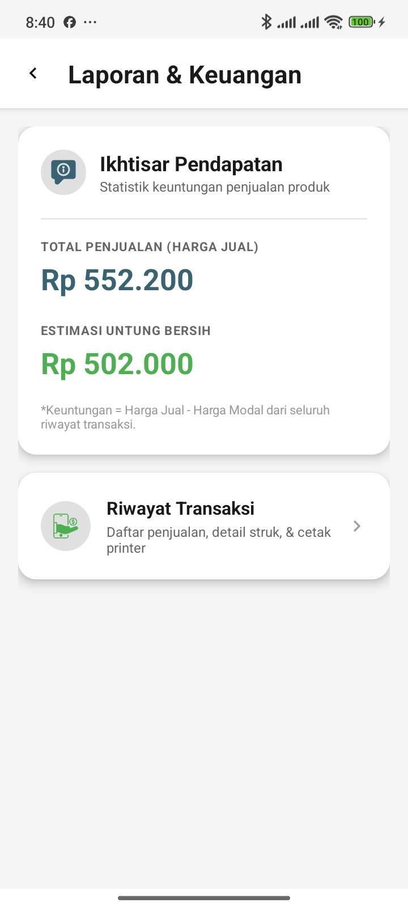 |

### 📦 Manajemen Menu & Kategori
| Daftar Menu (Produk) | Tambah/Edit Menu Baru | Pencarian Kategori | Tambah Kategori Baru |
| :---: | :---: | :---: | :---: |
| 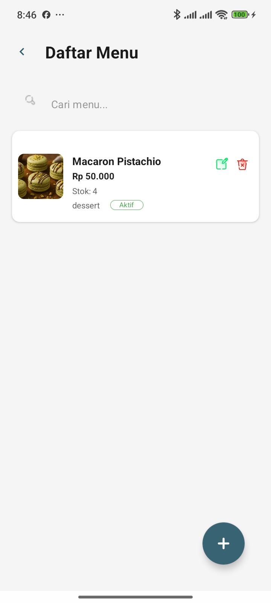 | 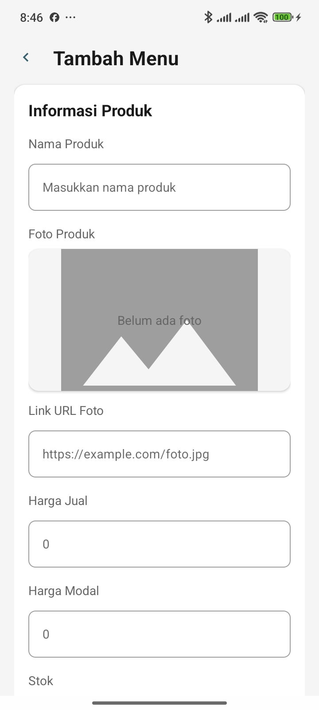 | 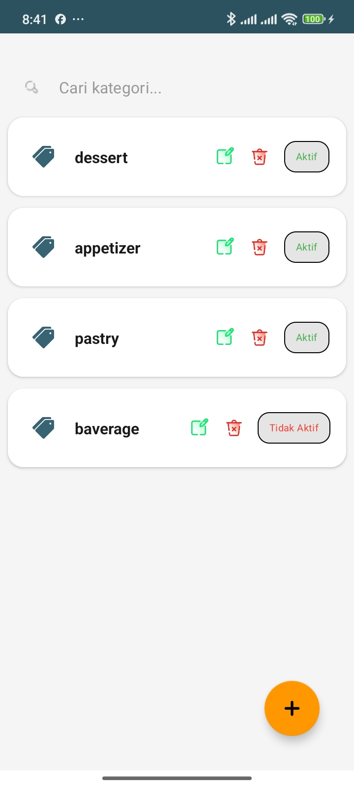 | 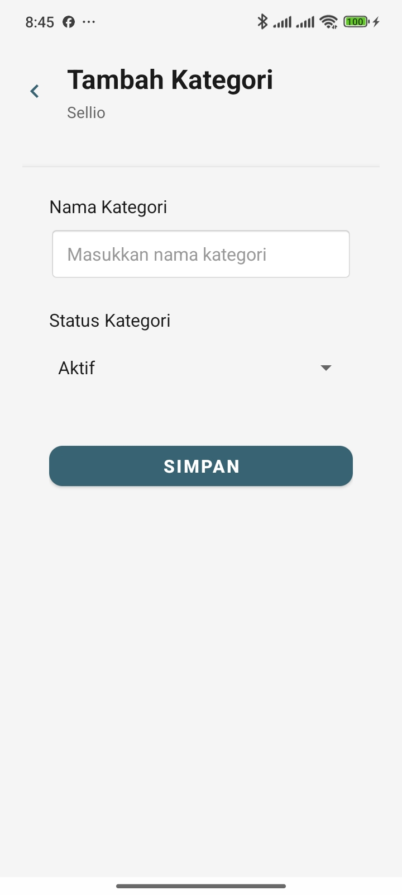 |

### 👥 Karyawan, Pelanggan, & Cabang
| Data Pegawai | Tambah Pegawai | Data Pelanggan | Tambah Pelanggan | Manajemen Cabang | Edit Cabang |
| :---: | :---: | :---: | :---: | :---: | :---: |
| 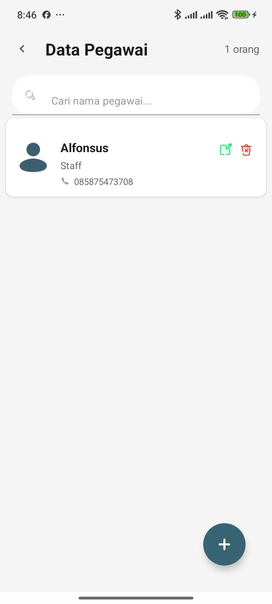 | 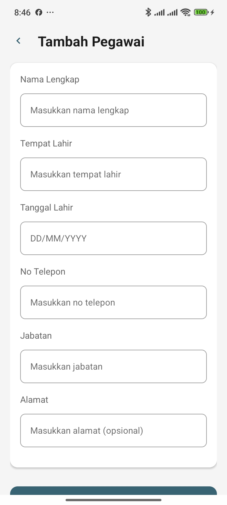 | 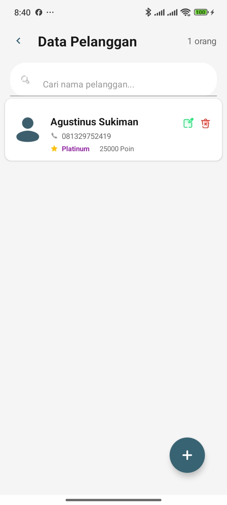 | 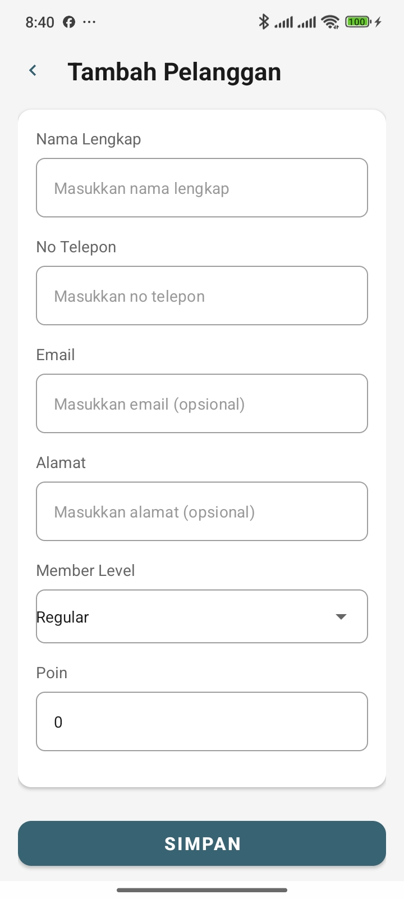 | 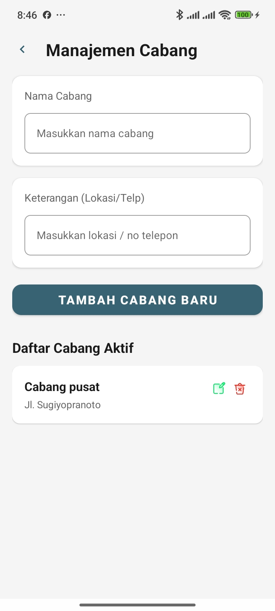 | 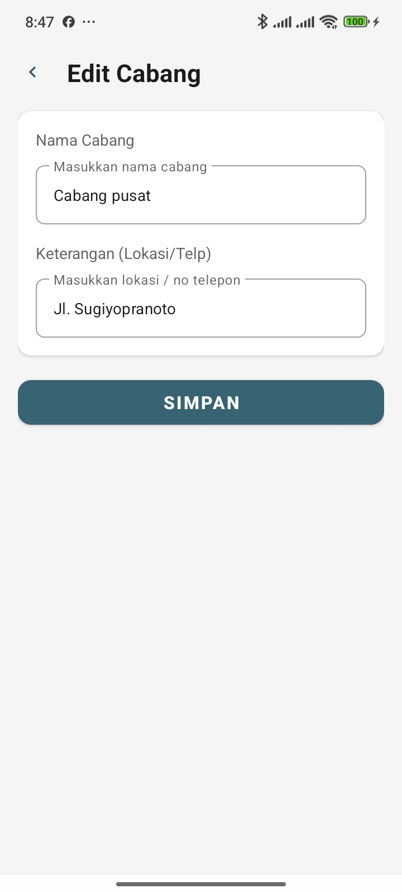 |

---

## 🛠️ Teknologi & Stack
- **Bahasa Pemrograman**: Kotlin (100% Native Android)
- **Desain Layout**: Android XML Layout (Material Design Components)
- **Basis Data**: Firebase Realtime Database
- **Manajemen Sesi**: SharedPreferences (Local Storage)
- **Komponen Utama**: CardView, TextInputLayout, ConstraintLayout, NestedScrollView, RecyclerView.

---

## 💻 Cara Menjalankan Proyek

1. **Persiapan**:
   - Instal [Android Studio](https://developer.android.com/studio) versi terbaru.
   - Hubungkan proyek Android Anda dengan Firebase (pastikan file `google-services.json` sudah diletakkan pada folder `/app`).

2. **Kloning Repositori**:
   ```bash
   git clone https://github.com/athaliacalya/PointOfSales.git
   ```

3. **Buka Proyek**:
   - Buka Android Studio -> Pilih **Open** -> Arahkan ke folder hasil klon proyek Sellio ini.

4. **Jalankan Aplikasi**:
   - Pilih perangkat emulator atau perangkat fisik Android yang terhubung.
   - Tekan tombol **Run (Shift + F10 / ikon Play)**.

5. **Kredensial Akun Default (untuk Pengujian Kasir)**:
   - **Email**: `admin@sellio.com`
   - **Kata Sandi**: `admin123`

---

## ✒️ Kontributor
- **Nama**: Athalia Calya
- **GitHub**: [@athaliacalya](https://github.com/athaliacalya)
